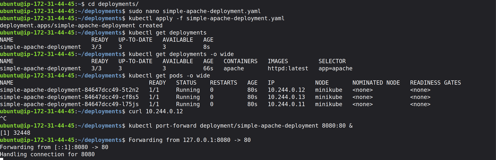
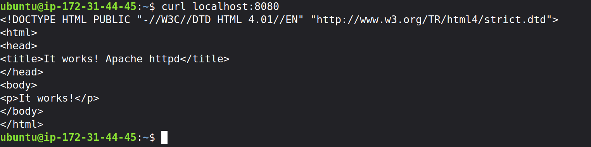

## Kubernetes Overview and Kubectl Command Cheatsheet

### Why Kubernetes?

Kubernetes (K8s) is an open-source orchestration platform that automates the deployment, scaling, and management of containerized applications. It solves the complexity of manual container management by providing self-healing (restarting failed containers), automated scaling (handling traffic spikes), and service discovery (internal networking), acting as a powerful "operating system" for cloud-native infrastructure.

### Fundamental Concepts

*   **Cluster**: A set of worker machines, called nodes, that run containerized applications. Every cluster has at least one worker node.
*   **Control Plane**: The container orchestration layer that exposes the API and interfaces to define, deploy, and manage the lifecycle of containers. It makes global decisions about the cluster (e.g., scheduling), and detects and responds to cluster events (e.g., starting up a new pod when a deployment's replicas field is unsatisfied).
*   **Node**: A worker machine in Kubernetes, which may be a VM or a physical machine, depending on the cluster. Each node is managed by the control plane and contains the services necessary to run Pods.
*   **Pod**: The smallest deployable units of computing that you can create and manage in Kubernetes. A Pod (as in a pod of whales or pea pod) is a group of one or more containers, with shared storage and network resources, and a specification for how to run the containers.
*   **Deployment**: An API object that manages a replicated application, typically by running Pods with no local state. A Deployment runs multiple replicas of your application and automatically replaces any instances that fail or become unresponsive.
*   **Service**: An abstract way to expose an application running on a set of Pods as a network service.
*   **Namespace**: Kubernetes supports multiple virtual clusters backed by the same physical cluster. These virtual clusters are called namespaces.
*   **ConfigMap**: An API object used to store non-confidential data in key-value pairs. Pods can consume ConfigMaps as environment variables, command-line arguments, or as configuration files in a volume.
*   **Secret**: An object that contains a small amount of sensitive data such as a password, a token, or a key.

### Kubectl Command Cheatsheet

Below are common `kubectl` commands and their usages.

#### Cluster Info & Configuration
*   `kubectl cluster-info`: Display addresses of the master and services.
*   `kubectl config view`: View the kubeconfig settings.
*   `kubectl config use-context <context-name>`: Switch to a different context.

#### Viewing Resources
*   `kubectl get all`: List all resources in the default namespace.
*   `kubectl get pods`: List all pods in the default namespace.
    *   `kubectl get pods -A` or `kubectl get pods --all-namespaces`: List pods in all namespaces.
    *   `kubectl get pods -o wide`: List pods with more details (like Node name and IP).
*   `kubectl get deployments`: List deployments.
*   `kubectl get services`: List services.
*   `kubectl get nodes`: List nodes.
*   `kubectl get namespaces`: List all namespaces in the cluster (alias: `kubectl get ns`).

#### Inspecting Resources
*   `kubectl describe pod <pod-name>`: Show detailed information about a specific pod.
*   `kubectl describe node <node-name>`: Show detailed information about a specific node.
*   `kubectl logs <pod-name>`: Print the logs for a container in a pod.
    *   `kubectl logs -f <pod-name>`: Stream logs.

#### Creating & Updating Resources
*   `kubectl apply -f <filename.yaml>`: Create or update resources defined in a YAML file.
*   `kubectl create deployment <name> --image=<image>`: Create a new deployment.
*   `kubectl expose deployment <name> --type=NodePort --port=<port>`: Expose a deployment as a service.
*   `kubectl scale deployment <name> --replicas=<number>`: Scale a deployment to a specific number of replicas.

#### Deleting Resources
*   `kubectl delete -f <filename.yaml>`: Delete resources defined in a YAML file.
*   `kubectl delete pod <pod-name>`: Delete a specific pod.
*   `kubectl delete pods --all`: Delete all pods in the current namespace.
*   `kubectl delete deployment <name>`: Delete a specific deployment.
*   `kubectl delete deployments --all`: Delete all deployments in the current namespace.
*   `kubectl delete service <name>`: Delete a specific service.
*   `kubectl delete all --all`: Delete almost all resources (pods, services, deployments) in the current namespace.

#### Debugging
*   `kubectl exec -it <pod-name> -- /bin/bash`: Start an interactive shell inside a running pod.
*   `kubectl top pod`: Display resource (CPU/Memory) usage for pods.
*   `kubectl top node`: Display resource usage for nodes.

### Example of the simple Deployment running on an EC2 Ubuntu instance 

